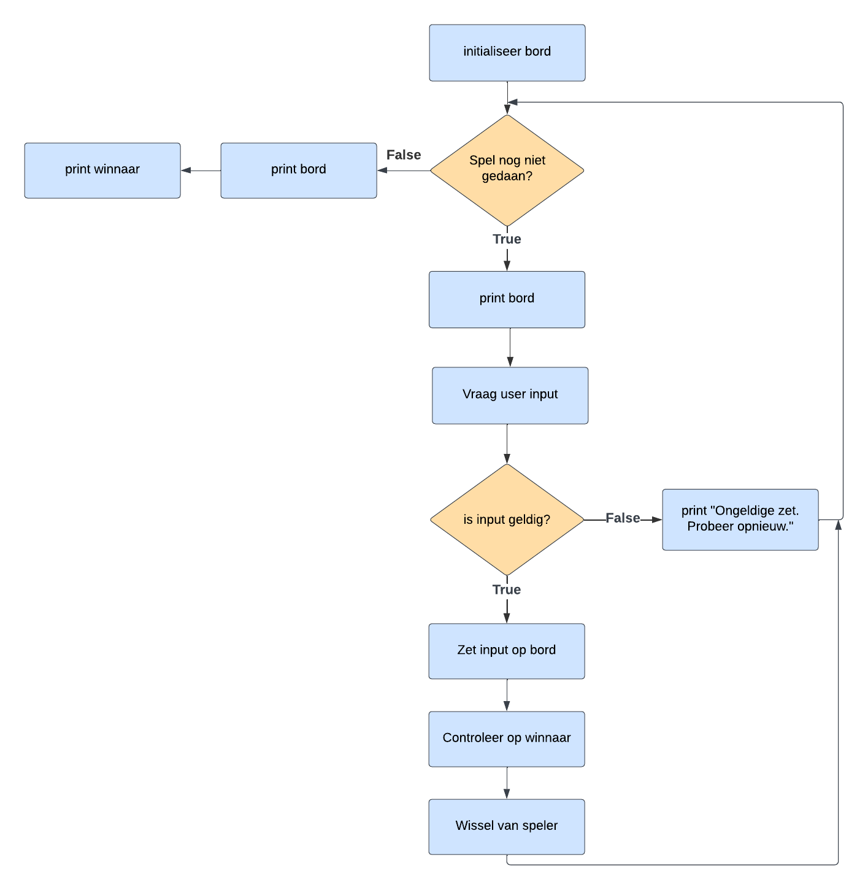

# Tic Tac Toe

# Stappen
- Spelbord aanmaken
- Spelbord printen
- Speler input vragen
- Zet van de speler toevoegen aan het spelbord
- Controleren op winnaar
  - horizontaal
  - verticaal
  - diagonaal

